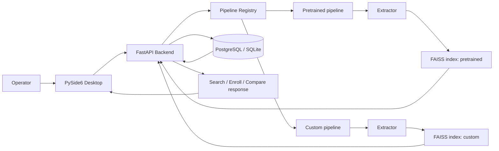

# System Architecture Diagram

Связано с:

- [[01_Project/02_Architecture]]
- [[01_Project/03_Backend]]
- [[01_Project/04_Desktop]]
- [[01_Project/06_API_and_Endpoints]]

## Что показывает схема

- desktop и backend разделены;
- runtime поддерживает несколько pipeline;
- для каждого pipeline есть свой индекс;
- БД хранит metadata и embeddings;
- поиск идёт через FAISS, а не через SQL как vector engine.
