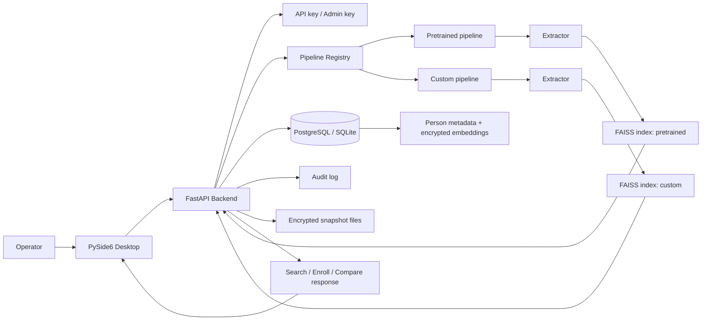

# System Architecture Diagram

Related notes:

- [[01_Project/02_Architecture]]
- [[01_Project/03_Backend]]
- [[01_Project/04_Desktop]]
- [[01_Project/06_API_and_Endpoints]]

## What this diagram shows

- desktop and backend are separated;
- the runtime supports multiple pipelines;
- each pipeline has its own index;
- the database stores metadata and encrypted embeddings;
- FAISS does vector search, not SQL;
- audit logging and encrypted snapshots are part of the runtime, not an external afterthought.
