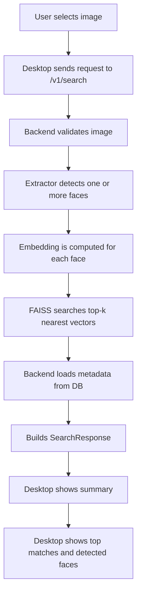

# Search Flow Diagram

Связано с:

- [[01_Project/02_Architecture]]
- [[01_Project/03_Backend]]
- [[01_Project/04_Desktop]]
- [[01_Project/06_API_and_Endpoints]]

## Ключевая мысль

Search — это workflow из нескольких этапов: validation, detection, embedding extraction, ANN retrieval, metadata hydration и UI presentation.
