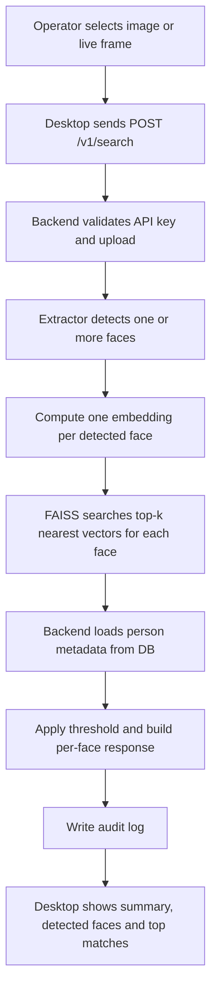

# Search Flow Diagram

Related notes:

- [[01_Project/02_Architecture]]
- [[01_Project/03_Backend]]
- [[01_Project/04_Desktop]]
- [[01_Project/06_API_and_Endpoints]]

## Key point

`Search` is a multi-step workflow: validation, multi-face detection, embedding extraction, approximate nearest-neighbor retrieval,
metadata hydration, decision logic, audit logging and UI presentation.
