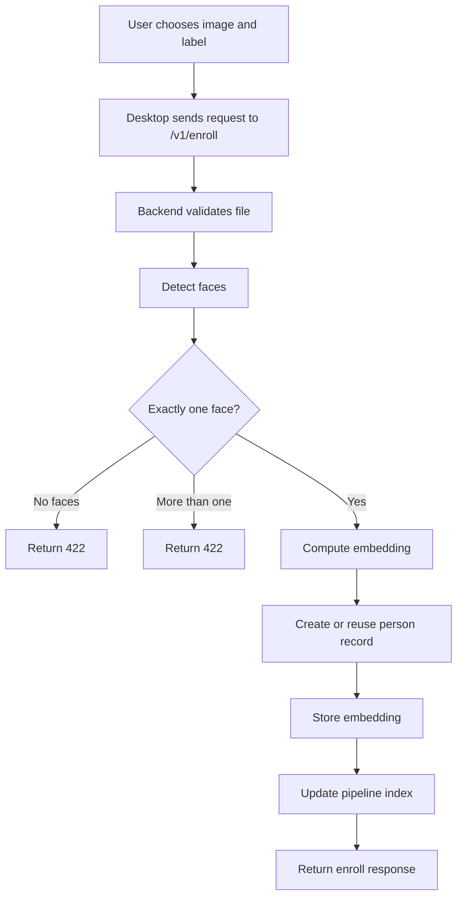

# Enroll Flow Diagram

Связано с:

- [[01_Project/03_Backend]]
- [[01_Project/04_Desktop]]
- [[01_Project/06_API_and_Endpoints]]

## Ключевая мысль

Enroll специально более строгий, чем search. Это сделано для чистоты базы и корректного соответствия one person -> one valid facial sample.
