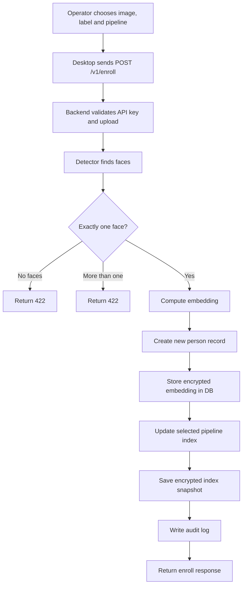

# Enroll Flow Diagram

Related notes:

- [[01_Project/03_Backend]]
- [[01_Project/04_Desktop]]
- [[01_Project/06_API_and_Endpoints]]

## Key point

`Enroll` is intentionally stricter than `Search`.
The current backend requires exactly one face and creates a new person record for that enroll request.
This keeps the gallery cleaner and avoids ambiguous person-to-face mapping.
