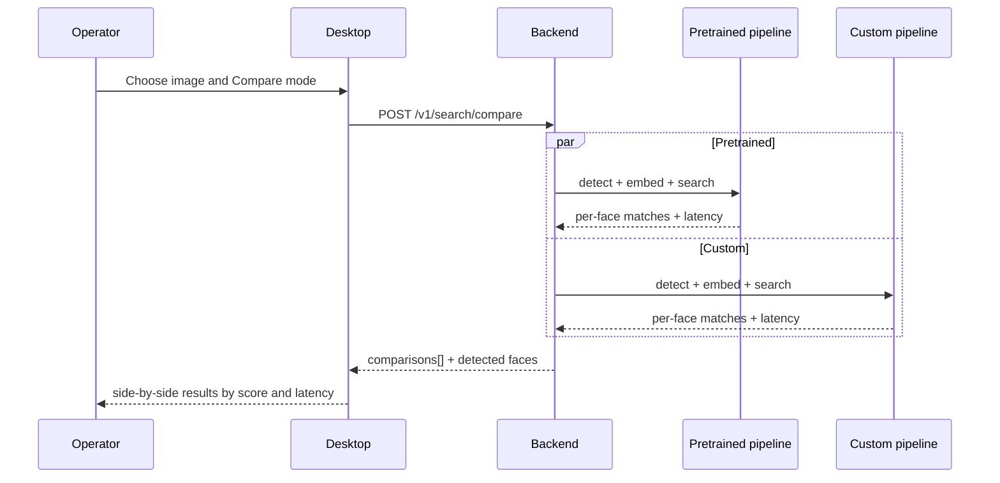

# Compare Mode Diagram

Related notes:

- [[01_Project/03_Backend]]
- [[01_Project/04_Desktop]]
- [[01_Project/06_API_and_Endpoints]]
- [[03_Research/03_Benchmarking]]

## Why this mode exists

- compare latency;
- compare pipeline behavior on the same input;
- show baseline vs comparative branch;
- use the same UI mode as a benchmark and demo tool.
