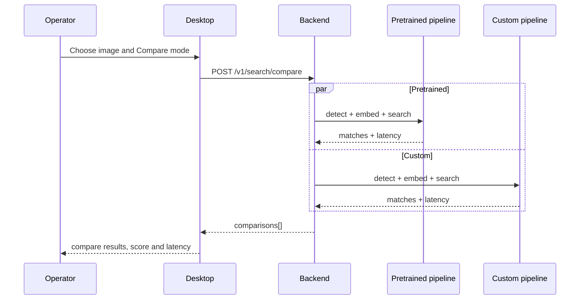

# Compare Mode Diagram

Связано с:

- [[01_Project/03_Backend]]
- [[01_Project/04_Desktop]]
- [[01_Project/06_API_and_Endpoints]]
- [[03_Research/03_Benchmarking]]

## Зачем нужен этот режим

- сравнить latency;
- сравнить поведение pipeline;
- показать baseline vs comparative branch;
- использовать режим как benchmark and demo tool.
