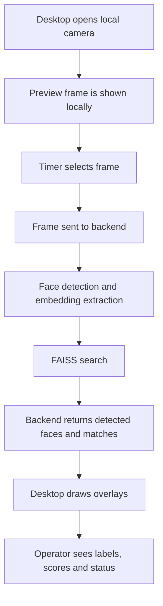

# Live Webcam Diagram

Связано с:

- [[01_Project/04_Desktop]]
- [[01_Project/03_Backend]]
- [[02_Defense/01_Demo_Script]]

## Важная формулировка

Это near real-time webcam workflow, а не тяжёлый постоянный видеострим на сервер. Preview живёт локально, а backend получает выбранные кадры по таймеру.
