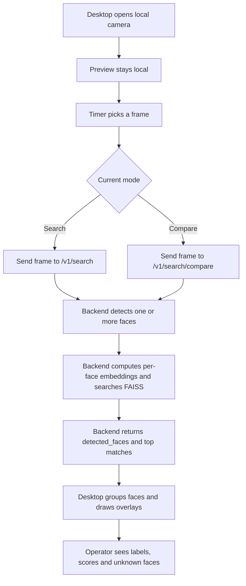

# Live Webcam Diagram

Related notes:

- [[01_Project/04_Desktop]]
- [[01_Project/03_Backend]]
- [[02_Defense/01_Demo_Script]]

## Important wording

This is a near real-time webcam workflow, not full video streaming to the server.
The preview stays local in the desktop app.
The backend receives selected frames at intervals and can process multiple faces in one frame.
